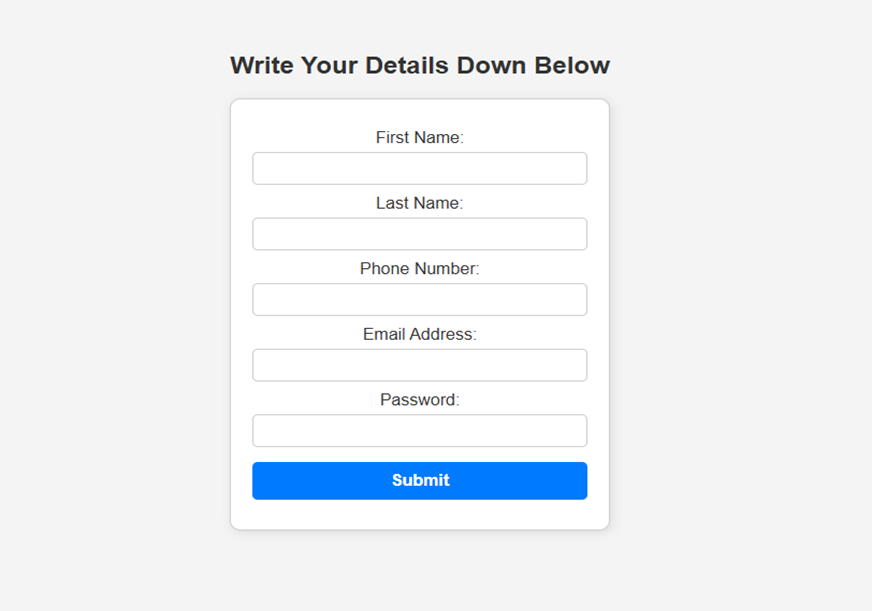
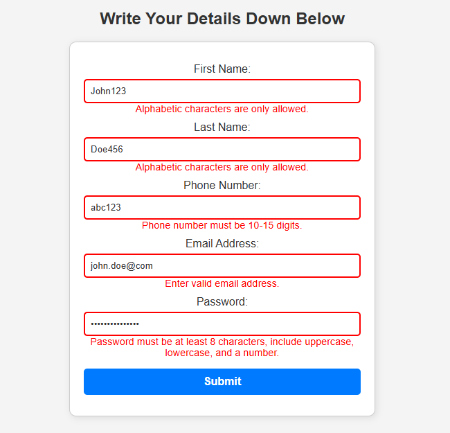
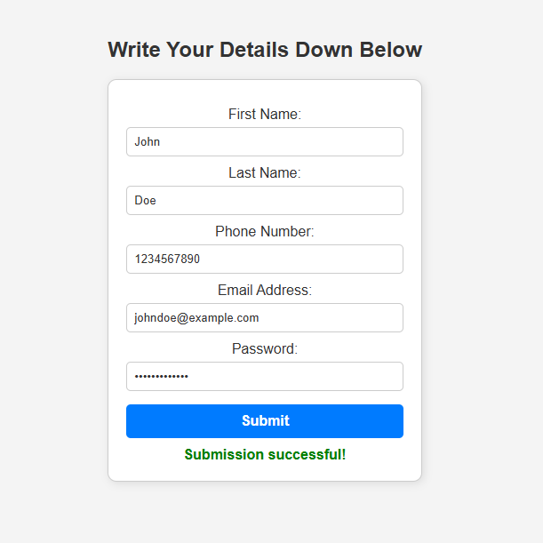

# Simple Web Form with JavaScript Validation

## Overview
This project is a simple web form that validates user input in real-time using JavaScript and regular expressions. The form includes fields for Full Name, Email, Phone Number, and Password. Each field is validated as the user types, and appropriate error messages are displayed for invalid inputs.

## Features
- **Real-time Validation**: Fields are validated as the user types.
- **Regular Expression Checks**:
  - Full Name: Only alphabetic characters and spaces are allowed.
  - Email: Must be a valid email format.
  - Phone Number: Only digits allowed (10-15 characters).
  - Password: Minimum 8 characters, including at least one uppercase letter, one lowercase letter, and one number.
- **Error Messages**: Displays validation messages below each input field.
- **Input Highlighting**:
  - Red border for invalid inputs.
  - Green border for valid inputs.
- **Submission Validation**: Prevents form submission until all fields are correctly filled.

## Project Structure
```
project-folder/
│-- index.html       # Main HTML file containing the form
│-- script.js        # JavaScript file for form validation
|--styles.css        # Contains all styles for the form
│-- README.md        # Project documentation (this file)
```

## Installation & Usage
1. **Download or Clone** this repository.
   ```sh
   git clone https://github.com/Maclaine-Kuria/js-regex-validation_Maclaine_Kuria
   ```
2. **Open `index.html`** in a web browser.
3. **Test the validation** by entering different inputs in the form fields.
4. **Fix validation errors** if needed and submit the form successfully.

## How It Works
1. The **HTML form** contains input fields and a submit button.

2. The **JavaScript file (`script.js`)**:
   - Listens for input events on fields.
   - Uses **Regular Expressions** to validate input.
   - Displays error messages for invalid inputs.
   - Highlights incorrect fields with a red border.
   - Highlights correct fields with a green border.
   - Displays a success message when the form is submitted correctly.
3. When **all fields are valid**, the form resets and shows a success message.

## Example Usage
- **Invalid Full Name:** "John123" → ❌ Error: "Only alphabetic characters and spaces allowed."
- **Valid Full Name:** "John Doe" → ✅ No error.
- **Invalid Email:** "john.doe@com" → ❌ Error: "Enter a valid email address."
- **Valid Email:** "john.doe@example.com" → ✅ No error.
- **Invalid Phone Number:** "abc123" → ❌ Error: "Enter a valid phone number (10-15 digits)."
- **Valid Phone Number:** "1234567890" → ✅ No error.
- **Invalid Password:** "password" → ❌ Error: "Must be 8+ chars, 1 uppercase, 1 lowercase, 1 number."
- **Valid Password:** "Passw0rd" → ✅ No error.

  




## Technologies Used
- **HTML** (for structure)
- **CSS** (for styling, basic error highlighting)
- **JavaScript** (for form validation and user interaction)

## Future Enhancements
- Add additional styling with **CSS frameworks (Bootstrap, Tailwind)**.
- Implement **server-side validation** for extra security.
- Enhance UI with **better animations and error messages**.

## License
This project is open-source and available under the **MIT License**.

## Author
Created by Maclaine Kuria. Feel free to contribute or suggest improvements!

